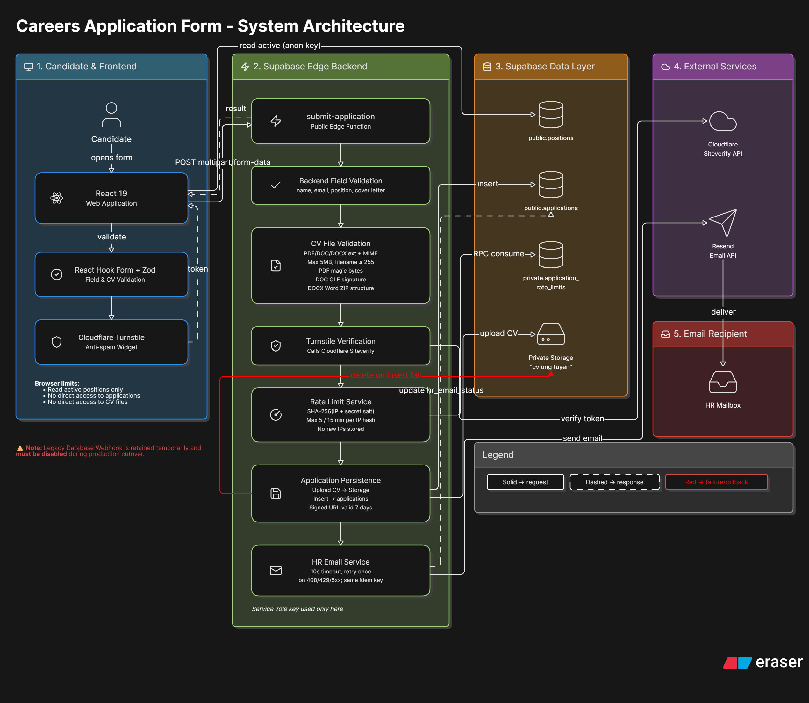

# Biểu Mẫu Ứng Tuyển

Một hệ thống form tuyển dụng full-stack được xây dựng bằng React và Supabase.
Ứng viên có thể chọn vị trí đang tuyển, tải CV, hoàn thành bước chống spam và
gửi hồ sơ. Supabase Edge Function sẽ xác thực dữ liệu, lưu hồ sơ và gửi thông
tin đến HR qua Resend.



## Mục Lục

- [Tính năng](#tính-năng)
- [Công nghệ sử dụng](#công-nghệ-sử-dụng)
- [Bắt đầu nhanh](#bắt-đầu-nhanh)
- [Biến môi trường](#biến-môi-trường)
- [Cấu hình Supabase](#cấu-hình-supabase)
- [Cấu trúc repository](#cấu-trúc-repository)
- [Kiến trúc hệ thống](#kiến-trúc-hệ-thống)
- [API](#api)
- [Validation và bảo mật](#validation-và-bảo-mật)
- [Kiểm thử](#kiểm-thử)
- [Triển khai](#triển-khai)
- [Tài liệu](#tài-liệu)
- [Đóng góp](#đóng-góp)
- [Giới hạn hiện tại](#giới-hạn-hiện-tại)
- [Reference](#reference)
- [Giấy phép](#giấy-phép)

## Tính Năng

- Form ứng tuyển bằng tiếng Việt.
- Danh sách vị trí đang tuyển được lấy từ PostgreSQL.
- Hỗ trợ CV định dạng PDF, DOC và DOCX, tối đa 5MB.
- Frontend validation bằng React Hook Form và Zod.
- Backend kiểm tra field, extension, MIME type, dung lượng và nội dung thật của
  file.
- CV được lưu trong private Supabase Storage bucket.
- Lưu hồ sơ và trạng thái gửi email HR trong PostgreSQL.
- Gửi email đồng bộ đến HR qua Resend.
- Xác minh chống spam bằng Cloudflare Turnstile.
- Rate limit theo IP đã hash và salt, không lưu raw IP.
- Rollback khi thao tác Storage hoặc database thất bại.
- Resend có timeout, retry một lần và idempotency key.
- Row Level Security bảo vệ positions, applications và CV.

## Công Nghệ Sử Dụng

| Thành phần | Công nghệ |
| --- | --- |
| Frontend | React 19, TypeScript, Vite |
| Giao diện | Tailwind CSS, Radix UI, shadcn/ui |
| Form | React Hook Form, Zod |
| Backend | Supabase Edge Functions, Deno |
| Database | Supabase PostgreSQL |
| Lưu file | Supabase Storage |
| Gửi email | Resend |
| Chống spam | Cloudflare Turnstile |
| Quản lý database | Supabase CLI migrations và seed |

## Bắt Đầu Nhanh

### Yêu cầu

- Node.js 20.19+ hoặc 22.12+.
- npm.
- Một Supabase project.
- Resend API key.
- Cloudflare Turnstile site key và secret key.
- Docker Desktop nếu muốn chạy toàn bộ Supabase stack ở local.

### Cài đặt

1. Clone repository:

   ```bash
   git clone https://github.com/lngthanhhuy/submitform.git
   cd submitform/ui
   ```

2. Cài dependencies:

   ```bash
   npm install
   ```

3. Tạo file `ui/.env` và thêm các biến frontend được mô tả bên dưới.

4. Chạy frontend:

   ```bash
   npm run dev
   ```

5. Truy cập [http://localhost:5173](http://localhost:5173).

### Production build

```bash
cd ui
npm run build
npm run lint
```

Frontend sau khi build nằm trong thư mục `ui/dist`.

## Biến Môi Trường

### Frontend

Tạo file `ui/.env`:

```dotenv
VITE_SUPABASE_URL=https://your-project-ref.supabase.co
VITE_SUPABASE_PUBLISHABLE_KEY=your-publishable-key
VITE_TURNSTILE_SITE_KEY=your-turnstile-site-key
```

### Edge Function secrets

Cấu hình bằng lệnh `supabase secrets set`:

| Biến | Mục đích |
| --- | --- |
| `RESEND_API_KEY` | Gửi email hồ sơ đến HR |
| `TURNSTILE_SECRET_KEY` | Xác minh Turnstile token |
| `RATE_LIMIT_SALT` | Salt IP hash dùng cho rate limit |
| `TURNSTILE_EXPECTED_HOSTNAME` | Giới hạn Turnstile theo hostname triển khai |
| `WEBHOOK_SECRET` | Xác thực legacy webhook còn được giữ lại |

Hosted Edge Functions tự cung cấp `SUPABASE_URL` và
`SUPABASE_SERVICE_ROLE_KEY`.

> Không commit file `.env`, API key, service-role key hoặc production secret
> lên Git.

## Cấu Hình Supabase

### Liên kết project

Chạy từ thư mục `ui`:

```bash
npx supabase login
npx supabase link --project-ref your-project-ref
```

### Áp dụng database migrations

```bash
npx supabase db push --linked --include-all
```

Các migration sẽ tạo:

- `public.positions`
- `public.applications`
- `private.application_rate_limits`
- Private Storage bucket `cv ung tuyen`
- RLS policies, grants, indexes và rate-limit RPC

### Tạo dữ liệu vị trí

Để reset database local:

```bash
npx supabase start
npx supabase db reset
```

File `ui/supabase/seed.sql` thêm hai vị trí mặc định:

- Developer
- Designer

### Cấu hình secrets

Ví dụ sử dụng các biến đã có trong shell:

```bash
npx supabase secrets set \
  RESEND_API_KEY="$RESEND_API_KEY" \
  TURNSTILE_SECRET_KEY="$TURNSTILE_SECRET_KEY" \
  RATE_LIMIT_SALT="$RATE_LIMIT_SALT" \
  TURNSTILE_EXPECTED_HOSTNAME="$TURNSTILE_EXPECTED_HOSTNAME" \
  --project-ref your-project-ref
```

### Deploy Edge Function

```bash
npx supabase functions deploy submit-application \
  --project-ref your-project-ref \
  --no-verify-jwt
```

JWT verification được tắt vì đây là form ứng tuyển public. Request được bảo vệ
bằng backend validation, Turnstile, rate limit và database access control.

## Cấu Trúc Repository

```text
submitform/
├── docs/
│   ├── README.md
│   ├── architecture.md
│   ├── api-reference.md
│   ├── deployment-guide.md
│   ├── implementation-history.md
│   └── qa-matrix.md
├── ui/
│   ├── src/
│   │   ├── components/
│   │   │   ├── CareerForm.tsx
│   │   │   ├── TurnstileWidget.tsx
│   │   │   └── career-form-schema.ts
│   │   ├── config/
│   │   └── pages/
│   ├── supabase/
│   │   ├── functions/
│   │   │   ├── _shared/
│   │   │   ├── resend/
│   │   │   └── submit-application/
│   │   ├── migrations/
│   │   ├── config.toml
│   │   └── seed.sql
│   ├── package.json
│   └── vite.config.ts
└── README.md
```

## Kiến Trúc Hệ Thống

Sơ đồ mô tả luồng từ ứng viên và React frontend qua Supabase Edge Function,
database, private Storage, Cloudflare Turnstile, Resend và hộp thư HR.

Luồng gửi hồ sơ:

1. Tải danh sách vị trí đang active.
2. Validate field và CV ở trình duyệt.
3. Tạo Turnstile token.
4. Gửi một multipart request đến `submit-application`.
5. Backend kiểm tra lại field, CAPTCHA, nội dung CV, position và rate limit.
6. Upload CV vào private Storage.
7. Insert application với trạng thái email `pending`.
8. Tạo signed CV URL có hiệu lực bảy ngày.
9. Gửi hồ sơ đến HR qua Resend.
10. Cập nhật trạng thái email và trả HTTP `201`.

Frontend chỉ báo thành công sau khi Resend chấp nhận request gửi email HR.

## API

### Gửi hồ sơ ứng tuyển

```http
POST /functions/v1/submit-application
Content-Type: multipart/form-data
```

| Field | Kiểu dữ liệu | Bắt buộc |
| --- | --- | --- |
| `firstname` | String | Có |
| `lastname` | String | Có |
| `email` | String | Có |
| `positionId` | UUID | Có |
| `coverletter` | String, tối đa 1000 ký tự | Có |
| `cv` | File PDF, DOC hoặc DOCX | Có |
| `turnstileToken` | String | Có |

Response thành công:

```json
{
  "success": true,
  "code": "APPLICATION_SUBMITTED",
  "applicationId": "application-uuid",
  "hrEmailId": "resend-email-id"
}
```

Xem [docs/api-reference.md](docs/api-reference.md) để biết toàn bộ response
code.

## Validation Và Bảo Mật

- Tên file CV tối đa 255 ký tự.
- Dung lượng CV tối đa 5MB.
- Kiểm tra extension và MIME type của PDF, DOC và DOCX.
- Kiểm tra PDF magic bytes, DOC OLE signature và cấu trúc Word của DOCX.
- Position phải tồn tại và đang active.
- Cover letter tối đa 1000 ký tự.
- Turnstile token được xác minh tại Edge Function.
- Mỗi IP hash được gửi tối đa năm request hợp lệ trong 15 phút.
- Không lưu raw IP.
- CV được lưu private và chỉ mở qua signed URL có thời hạn.
- Browser role không được đọc hoặc ghi trực tiếp applications và CV.
- Service-role key chỉ được sử dụng bên trong hosted Edge Function.

## Kiểm Thử

Dự án đã được kiểm tra với tám frontend acceptance cases và 35 backend module
cases. Các file automated test đã được xóa sau khi hoàn thành quá trình kiểm
thử.

Các lệnh kiểm tra hiện tại:

```bash
cd ui
npm run build
npm run lint
./node_modules/deno/deno check supabase/functions/submit-application/index.ts
./node_modules/deno/deno lint supabase/functions
```

Sử dụng [docs/qa-matrix.md](docs/qa-matrix.md) để regression test thủ công và
kiểm thử end-to-end.

## Triển Khai

Luồng triển khai được đề xuất:

1. Tạo Supabase project riêng cho staging.
2. Áp dụng migrations và seed positions.
3. Cấu hình Turnstile key thật và expected hostname.
4. Cấu hình Resend sender đã verify cho production.
5. Deploy `submit-application`.
6. Build và deploy `ui/dist`.
7. Hoàn thành checklist end-to-end trên staging.
8. Vô hiệu database webhook cũ trước khi nhận traffic production để tránh gửi
   email trùng.

Xem [docs/deployment-guide.md](docs/deployment-guide.md) để biết đầy đủ quy
trình staging, production và rollback.

## Tài Liệu

- [Đặc tả chức năng](docs/README.md)
- [Kiến trúc](docs/architecture.md)
- [API reference](docs/api-reference.md)
- [QA matrix](docs/qa-matrix.md)
- [Hướng dẫn triển khai](docs/deployment-guide.md)
- [Lịch sử triển khai](docs/implementation-history.md)

## Đóng Góp

1. Fork repository.
2. Tạo feature branch:

   ```bash
   git checkout -b feat/your-feature
   ```

3. Cài dependencies và cấu hình môi trường local.
4. Không đưa secrets vào Git.
5. Chạy build, lint, Deno check và Deno lint.
6. Cập nhật tài liệu khi behavior thay đổi.
7. Tạo pull request với mô tả và kết quả kiểm tra rõ ràng.

Commit prefix được đề xuất:

- `feat:` tính năng mới
- `fix:` sửa lỗi
- `docs:` cập nhật tài liệu
- `refactor:` cải thiện code nội bộ

## Giới Hạn Hiện Tại

- Chưa có dashboard quản trị HR.
- Không gửi email xác nhận cho ứng viên.
- Chưa scan malware hoặc virus.
- Repository hiện không còn automated test source.
- Resend accepted không đảm bảo email đã vào inbox.
- Demo sender cần được thay bằng production domain đã verify.
- Staging browser E2E và production cutover vẫn là bước triển khai thủ công.

## Reference

### Supabase

- [Edge Functions Overview](https://supabase.com/docs/guides/functions)
- [Managing Edge Function Dependencies](https://supabase.com/docs/guides/functions/dependencies)
- [Edge Function Environment Variables and Secrets](https://supabase.com/docs/guides/functions/secrets)
- [Deploy Edge Functions to Production](https://supabase.com/docs/guides/functions/deploy)
- [Invoke an Edge Function with supabase-js](https://supabase.com/docs/reference/javascript/functions-invoke)
- [Database Webhooks](https://supabase.com/docs/guides/database/webhooks)
- [Database Migrations and Seed Data](https://supabase.com/docs/guides/deployment/database-migrations)
- [Row Level Security](https://supabase.com/docs/guides/database/postgres/row-level-security)
- [Storage Access Control](https://supabase.com/docs/guides/storage/security/access-control)
- [Create a Storage Signed URL](https://supabase.com/docs/reference/javascript/storage-from-createsignedurl)
- [Cloudflare Turnstile with Edge Functions](https://supabase.com/docs/guides/functions/examples/cloudflare-turnstile)
- [Sending Emails from Edge Functions](https://supabase.com/docs/guides/functions/examples/send-emails)

### Deno

- [Deno and Visual Studio Code](https://docs.deno.com/runtime/reference/vscode/)

### Cloudflare

- [Turnstile Server-side Validation](https://developers.cloudflare.com/turnstile/get-started/server-side-validation/)

### Resend

- [Send Email API](https://resend.com/docs/api-reference/emails/send-email)
- [Managing Sending Domains](https://resend.com/docs/dashboard/domains/introduction)

### README

- [How to Structure Your README File - freeCodeCamp](https://www.freecodecamp.org/news/how-to-structure-your-readme-file/)

## Giấy Phép

Dự án chưa khai báo giấy phép mã nguồn mở. Nếu chưa có file license, repository
vẫn thuộc bản quyền của chủ sở hữu.

---

Được xây dựng bởi [lngthanhhuy](https://github.com/lngthanhhuy).
