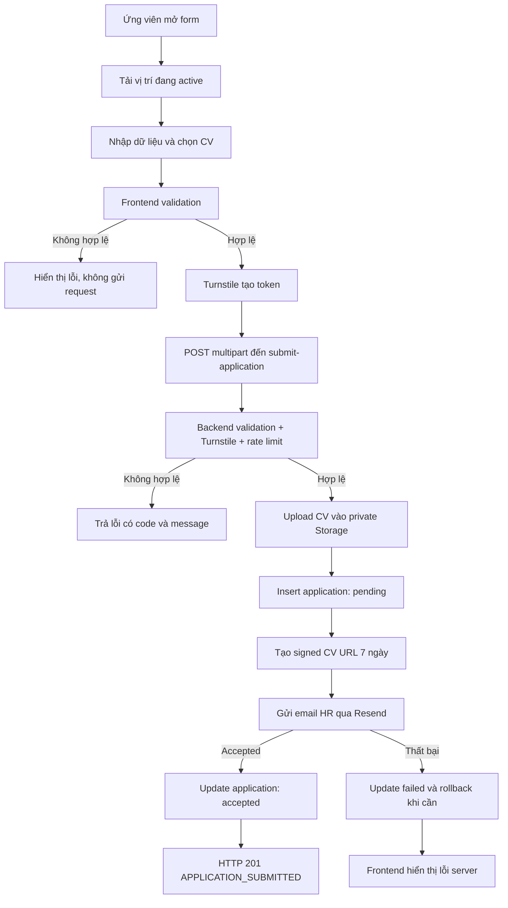

# Submit Form Careers

Tài liệu này mô tả phiên bản đã triển khai của form ứng tuyển, được đối chiếu
với đặc tả ban đầu trong `Submit_form_careers.pdf`.

## 1. Tổng quan

### Mục tiêu

Cho phép ứng viên gửi hồ sơ trực tuyến. Hệ thống chỉ báo thành công sau khi:

1. Dữ liệu và CV hợp lệ ở frontend và backend.
2. CAPTCHA và rate limit hợp lệ.
3. CV được lưu vào Storage.
4. Hồ sơ được lưu vào database.
5. Resend chấp nhận email gửi đến HR.

Lưu ý: `accepted` từ Resend xác nhận nhà cung cấp đã nhận yêu cầu gửi email,
không đảm bảo email đã vào hộp thư của HR.

### Đối tượng sử dụng

- Ứng viên gửi hồ sơ.
- HR nhận email và mở CV qua signed URL.
- Developer vận hành Supabase, Resend và Cloudflare Turnstile.

### Phạm vi hiện tại

- React form bằng tiếng Việt.
- Danh sách vị trí lấy từ `public.positions`.
- CV PDF, DOC hoặc DOCX, tối đa 5MB.
- Supabase Edge Function xử lý đồng bộ toàn bộ submission.
- Supabase Storage lưu CV ở bucket private.
- PostgreSQL lưu hồ sơ và trạng thái email HR.
- Resend gửi email cho HR.
- Cloudflare Turnstile và rate limit giảm spam.
- QA matrix lưu lại các case đã kiểm thử trước khi test source được dọn khỏi repo.

### Ngoài phạm vi hiện tại

- Dashboard HR.
- Email xác nhận ứng viên.
- Antivirus/malware scanning.
- Giới hạn số lần ứng tuyển theo email.
- Production cutover và vô hiệu webhook cũ.

## 2. User flow



### Luồng lỗi

- Validation frontend thất bại: không upload, insert hoặc gọi Edge Function.
- Validation backend thất bại: không upload, insert hoặc gửi email.
- Upload thành công nhưng insert thất bại: xóa CV vừa upload.
- Không tạo được signed URL hoặc email HR thất bại: lưu trạng thái lỗi và trả
  response thất bại.
- Request lặp khi đang xử lý: nút submit bị disable.

## 3. Wireframe chức năng

```text
+------------------------------------------------------+
|                    CAREERS FORM                      |
+--------------------------+---------------------------+
| Họ                       | Tên                       |
| [____________________]   | [____________________]    |
+------------------------------------------------------+
| Email                                                |
| [__________________________________________________] |
+------------------------------------------------------+
| Vị trí ứng tuyển                                     |
| [ Chọn vị trí                                  v ]   |
+------------------------------------------------------+
| CV: PDF, DOC, DOCX - tối đa 5MB                      |
| [ Chọn file ]  ten-file.pdf                          |
+------------------------------------------------------+
| Thư giới thiệu                                       |
| [__________________________________________________] |
| [__________________________________________________] |
+------------------------------------------------------+
| Cloudflare Turnstile                                 |
| [ Gửi hồ sơ ]                                        |
+------------------------------------------------------+
| Lỗi hiển thị cạnh field hoặc bằng toast              |
+------------------------------------------------------+
```

Giao diện hiện tại giữ hai field `Họ` và `Tên` tách riêng theo yêu cầu.

## 4. Data specification

| Field | Bắt buộc | Quy tắc |
| --- | --- | --- |
| Họ | Có | Trim, không được rỗng |
| Tên | Có | Trim, không được rỗng |
| Email | Có | Trim, đúng định dạng email |
| Vị trí | Có | Phải tồn tại và đang active |
| CV | Có | PDF/DOC/DOCX, tối đa 5MB, tên tối đa 255 ký tự |
| Thư giới thiệu | Có | Trim, tối đa 1000 ký tự |
| Turnstile token | Có | Backend xác minh với Cloudflare |

Backend kiểm tra extension, MIME type và nội dung thực:

- PDF: magic bytes `%PDF-`.
- DOC: OLE/Compound File signature.
- DOCX: ZIP Office có cấu trúc Word.

## 5. Validation messages

| Trường hợp | Message |
| --- | --- |
| Bỏ trống tên | `Vui lòng nhập tên` |
| Bỏ trống họ | `Vui lòng nhập họ` |
| Email trống | `Vui lòng nhập email` |
| Email sai định dạng | `Email không hợp lệ` |
| Chưa chọn vị trí | `Vui lòng chọn vị trí ứng tuyển` |
| Chưa upload CV | `Vui lòng đính kèm CV` |
| File sai định dạng | `Chỉ hỗ trợ file PDF, DOC hoặc DOCX` |
| File quá lớn | `File CV không được vượt quá 5MB` |
| Tên file quá dài | `Tên file CV quá dài` |
| Thư giới thiệu trống | `Vui lòng nhập thư giới thiệu` |
| Thư giới thiệu quá dài | `Giới thiệu bản thân không được vượt quá 1000 ký tự` |
| Rate limit | `Bạn đã gửi quá nhiều hồ sơ. Vui lòng thử lại sau` |
| Lỗi server | `Không thể gửi hồ sơ. Vui lòng thử lại sau` |

## 6. Business rules

- **BR-01:** Chỉ báo thành công khi Resend chấp nhận email gửi HR.
- **BR-02:** Frontend và backend đều validate dữ liệu.
- **BR-03:** CV phải vượt qua extension, MIME, magic bytes, kích thước và tên file.
- **BR-04:** Email HR gồm họ tên, email, vị trí, cover letter, thời gian và signed
  CV URL.
- **BR-05:** Disable submit trong lúc request đang xử lý.
- **BR-06:** Database được dùng để tracking hồ sơ và trạng thái email.
- **BR-07:** Mỗi IP hash được gửi tối đa 5 request hợp lệ trong 15 phút.
- **BR-08:** Không lưu raw IP.
- **BR-09:** Không gửi email xác nhận ứng viên trong phiên bản hiện tại.

## 7. Quyết định khác đặc tả ban đầu

| Chủ đề | Đặc tả ban đầu | Phiên bản đã triển khai |
| --- | --- | --- |
| Họ tên | Một field | Giữ `Họ` và `Tên` tách riêng |
| Database | MVP không lưu | Có lưu để tracking và rollback |
| Cover letter | Có đề cập 2000 ký tự | Thực tế giới hạn 1000 ký tự |
| Email ứng viên | Không gửi ở MVP | Không gửi |
| Webhook | Database webhook | React gọi trực tiếp Edge Function đồng bộ |
| Thành công | Backend/email hoàn tất | Resend phải trả accepted |

Webhook cũ vẫn được giữ để phục vụ đối chiếu lịch sử, nhưng phải được vô hiệu
trong production cutover để tránh gửi email trùng.

## 8. Tài liệu liên quan

- [Kiến trúc](architecture.md)
- [API reference](api-reference.md)
- [QA matrix](qa-matrix.md)
- [Deployment guide](deployment-guide.md)
- [Lịch sử triển khai](implementation-history.md)

## 9. Trạng thái

Tính đến ngày 15/06/2026:

- Cases 1-9 đã triển khai.
- Kết quả lịch sử trước khi xóa test source: frontend 8/8 pass, backend 35/35 pass.
- Build, ESLint, Deno check và Deno lint pass.
- Migration đã áp dụng lên Supabase project liên kết.
- Repository hiện không còn automated test source theo quyết định dọn dự án.
- Full staging browser E2E và production cutover chưa thực hiện.
