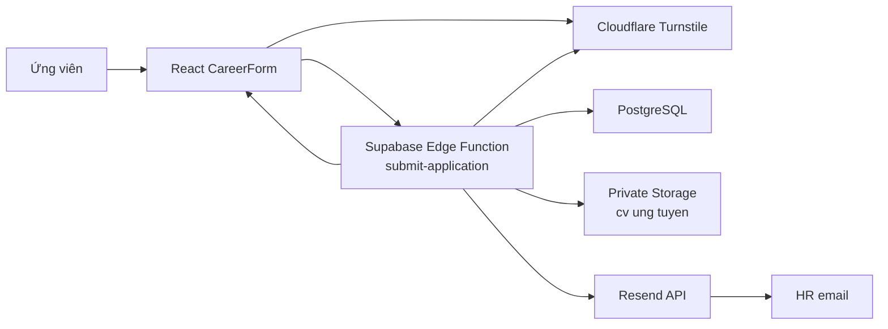

# Kiến trúc hệ thống

## 1. Thành phần

| Thành phần | Công nghệ | Trách nhiệm |
| --- | --- | --- |
| Web form | React 19, TypeScript, Vite | Nhập liệu, validation, Turnstile, hiển thị kết quả |
| Form validation | React Hook Form, Zod | Chặn dữ liệu sai trước request |
| Backend | Supabase Edge Functions, Deno | Validation tin cậy và điều phối submission |
| Database | Supabase PostgreSQL | Positions, applications, email status, rate limit |
| File storage | Supabase Storage | Lưu CV private và tạo signed URL |
| Email | Resend | Gửi hồ sơ tới HR |
| CAPTCHA | Cloudflare Turnstile | Xác minh request từ người dùng |
| QA record | Markdown QA matrix | Lưu case và kết quả kiểm thử lịch sử |

## 2. Sơ đồ runtime



### Submission pipeline

1. Frontend load vị trí active bằng Supabase anon key.
2. Frontend validate field và CV.
3. Turnstile cấp token.
4. Frontend gửi một request `multipart/form-data`.
5. Edge Function validate field, file, CAPTCHA và position.
6. Rate limiter kiểm tra IP hash.
7. Edge Function upload CV.
8. Edge Function insert application với `hr_email_status = pending`.
9. Edge Function tạo signed URL có hiệu lực 7 ngày.
10. Resend gửi email HR, timeout 10 giây và retry tối đa một lần.
11. Database chuyển trạng thái `accepted` hoặc `failed`.
12. Frontend chỉ hiển thị thành công khi nhận HTTP 201.

## 3. Database

### `public.positions`

| Column | Mục đích |
| --- | --- |
| `id uuid` | Primary key |
| `title text` | Tên vị trí |
| `is_active boolean` | Cho phép hiển thị và ứng tuyển |
| `created_at timestamptz` | Thời gian tạo |

Seed hiện tại: `Developer`, `Designer`.

### `public.applications`

| Column | Mục đích |
| --- | --- |
| `id uuid` | Primary key |
| `last_name text` | Họ |
| `first_name text` | Tên |
| `email text` | Email ứng viên |
| `position_id uuid` | Foreign key tới positions |
| `cv_path text` | Object path trong private Storage |
| `cover_letter text` | Thư giới thiệu |
| `created_at timestamptz` | Thời gian gửi |
| `submission_source text` | `browser` hoặc `edge_function` |
| `hr_email_status text` | `not_tracked`, `pending`, `accepted`, `failed` |
| `hr_email_id text` | ID trả về từ Resend |
| `hr_email_error text` | Lỗi cuối cùng nếu gửi thất bại |
| `hr_email_sent_at timestamptz` | Thời điểm Resend accepted |

### `public.application_rate_limits`

| Column | Mục đích |
| --- | --- |
| `key_hash text` | SHA-256 của `ip:salt`, không lưu raw IP |
| `window_started_at timestamptz` | Đầu cửa sổ rate limit |
| `request_count integer` | Số request trong cửa sổ |
| `updated_at timestamptz` | Thời gian cập nhật |

Giới hạn hiện tại: 5 request hợp lệ trên mỗi IP hash trong 15 phút.

## 4. Storage

- Bucket: `cv ung tuyen`.
- Public: `false`.
- File size limit: 5MiB.
- MIME: PDF, Microsoft Word DOC và DOCX.
- Object path: `edge/{positionId}/{randomUUID}.{extension}`.
- Browser không có policy upload trực tiếp.
- Edge Function dùng service role để quản lý object.

## 5. Security model

- `anon` và `authenticated` chỉ đọc positions đang active.
- Browser không được đọc/ghi applications.
- Browser không được đọc/ghi object CV.
- Service role chỉ tồn tại trong hosted Edge Function.
- Secrets không nằm trong Git.
- CAPTCHA được xác minh ở backend.
- Rate limit dùng IP hash có salt.
- CV được kiểm tra extension, MIME và magic bytes.
- Signed URL hết hạn sau 7 ngày.

### Giới hạn bảo mật còn lại

- Chưa scan malware/virus.
- Test Turnstile key luôn pass, không dùng cho production.
- Sender `onboarding@resend.dev` chỉ phù hợp demo; production cần domain đã verify.
- Legacy webhook chưa vô hiệu, cần xử lý ở production cutover.

## 6. Reliability và rollback

| Điểm lỗi | Cách xử lý |
| --- | --- |
| Upload CV lỗi | Không insert application |
| Insert application lỗi | Xóa CV vừa upload |
| Signed URL lỗi | Đánh dấu lỗi và trả failure |
| Resend timeout/network/408/429/5xx | Retry một lần sau 500ms |
| Resend thất bại cuối | Lưu `failed`, không trả success |
| Database update trạng thái lỗi | Ghi log; response phản ánh lỗi pipeline |

Resend sử dụng cùng idempotency key `hr-application/{applicationId}` cho lần
gửi đầu và retry để giảm nguy cơ gửi trùng.

## 7. Cấu trúc mã nguồn chính

```text
ui/src/components/
  CareerForm.tsx
  TurnstileWidget.tsx
  career-form-schema.ts

ui/supabase/functions/submit-application/
  index.ts
  application-persistence.ts
  cv-validation.ts
  rate-limit.ts
  turnstile.ts

ui/supabase/functions/_shared/
  hr-email.ts

ui/supabase/migrations/
  20260614000000_create_application_schema.sql
  20260615000000_allow_doc_cv_mime.sql
  20260615010000_add_submission_source.sql
  20260615020000_add_hr_email_status.sql
  20260615030000_add_application_rate_limits.sql
  20260615040000_fix_application_rate_limit_timestamp.sql
```
